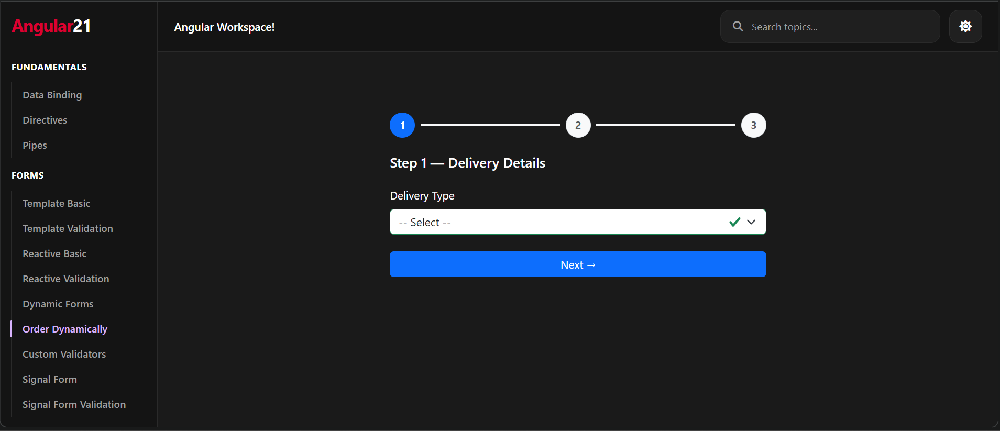
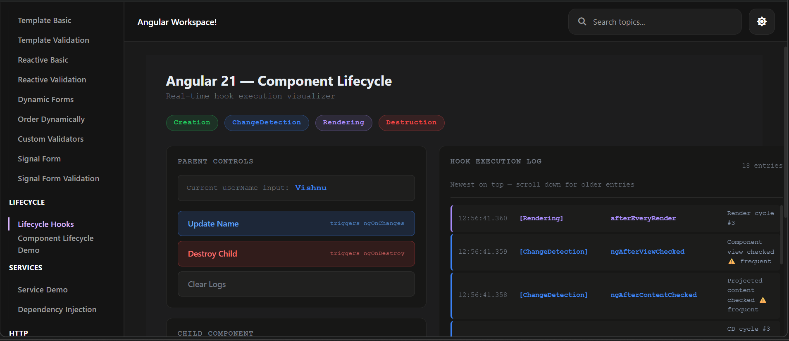
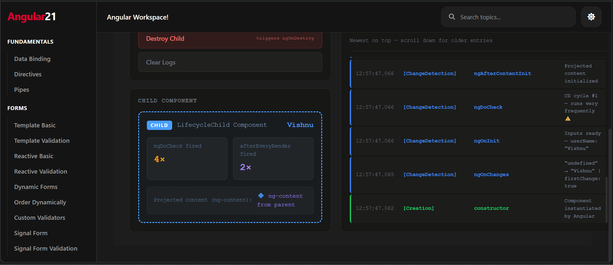

# Angular 21 Playground ⚡

> not ur average tutorial project. this is a **full Angular 21 curriculum app** — built from scratch, covers everything, runs live.


---

## what even is this 👀

a hands-on **Angular 21 workspace** built to deeply understand (and teach) modern Angular.
**13 topics. 40+ concepts. real API calls. live visualizers.** all in one app with a sidebar nav.

> built it. broke it. fixed it. understood it. now it's here.

---

## screenshots 📸

<p align="center">
  
  &nbsp;&nbsp;
  
</p>
<p align="center">
  
</p>

---

## tech stack 🔧

| thing | detail |
|---|---|
| Angular 21 | Standalone Components, `@if` / `@for` control flow |
| TypeScript | Strict mode throughout |
| Change Detection | Zoneless — `provideExperimentalZonelessChangeDetection()` |
| State | Signals — `signal()`, `computed()`, `effect()` |
| Forms | Reactive + Template + Signal Forms (Angular 21) |
| HTTP | `HttpClient` + JSONPlaceholder API |
| UI | Bootstrap 5 · Angular Material · PrimeNG |

---

## what's inside 📦

| # | topic | key concepts |
|---|---|---|
| 1 | **Fundamentals** | Data Binding, Directives, Pipes |
| 2 | **Forms** | Template, Reactive, Dynamic, Custom Validators, Signal Forms |
| 3 | **Lifecycle** | All 8 hooks + real-time parent/child visualizer |
| 4 | **Services & DI** | `inject()`, singleton services, hierarchical DI |
| 5 | **HTTP** | CRUD, Interceptors, Error Handling, Async & Promises |
| 6 | **RxJS** | Observables, Subjects, Operators, API Stream |
| 7 | **Routing** | Route Params, Guards, Lazy Loading (`loadComponent`) |
| 8 | **State Management** | Signals Store, Signal Inputs, NgRx Basics |
| 9 | **Authentication** | JWT Login, Route Protection |
| 10 | **Performance** | TrackBy, `@defer`, OnPush, signal memoization |
| 11 | **UI Components** | Bootstrap, Angular Material, PrimeNG |
| 12 | **Architecture** | Feature structure, Micro Frontend |
| 13 | **Extras** | Debugging patterns |

---

## highlights ✨

**🔬 lifecycle hook visualizer** — real-time log showing exactly which hook fires, when, and why. built with `runOutsideAngular` + buffer/flush pattern to dodge infinite CD loops.

**📝 signal forms** — working demo of Angular 21's `@angular/forms/signals` API with full CRUD + validation. barely anyone's built this yet.

**⚡ fully zoneless** — zero Zone.js. entire app runs on `provideExperimentalZonelessChangeDetection()`.

---

## getting started 🚀

```bash
git clone https://github.com/vishnu1845/Angular-21-playground.git
cd Angular-21-playground
npm install
ng serve
```

open `http://localhost:4200` → pick any topic from the sidebar.

---

## project structure 🗂️

```
src/app/
├── core/        # services, interceptors, guards, utils
├── features/    # one folder per topic (forms, lifecycle, routing...)
└── shared/      # reusable components, pipes, directives
```

---

## connect 🔗

[](https://www.linkedin.com/in/vishnu-bandgar/)
[](https://github.com/vishnu1845)

---

<p align="center">built with curiosity. breaks occasionally. learning always. 🔥</p>